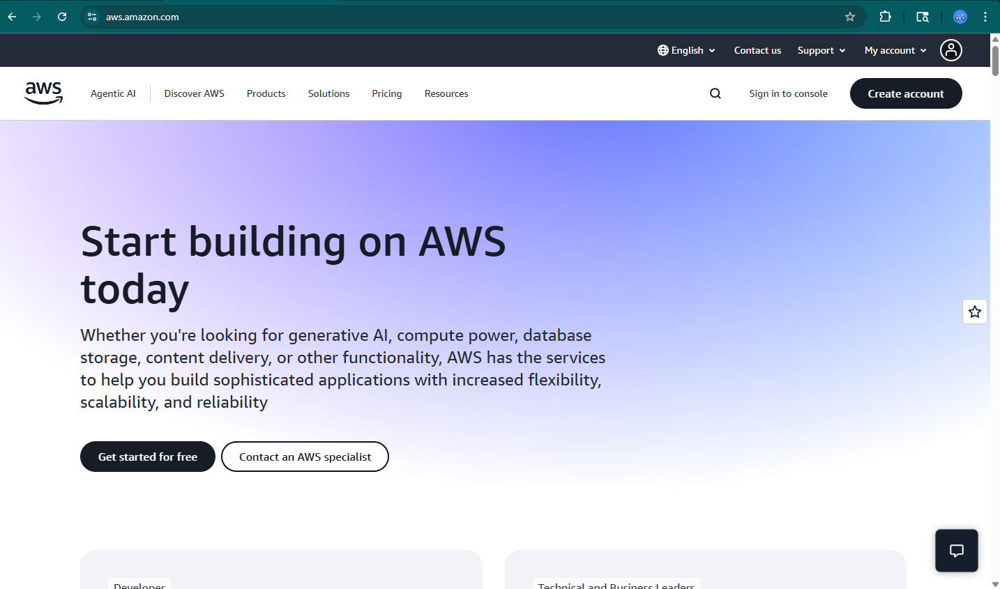
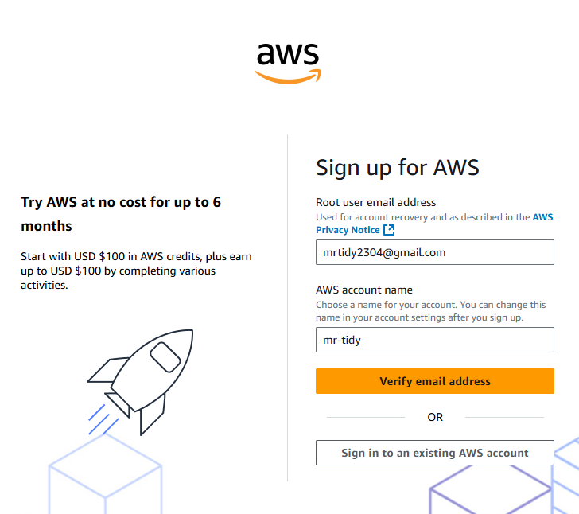
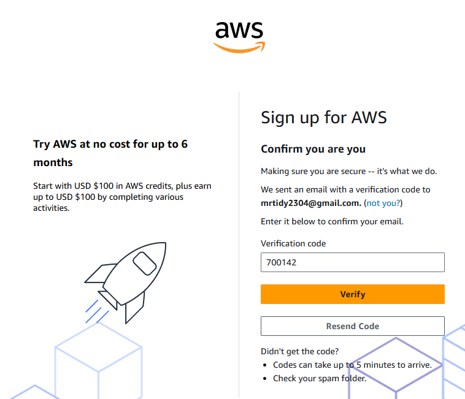
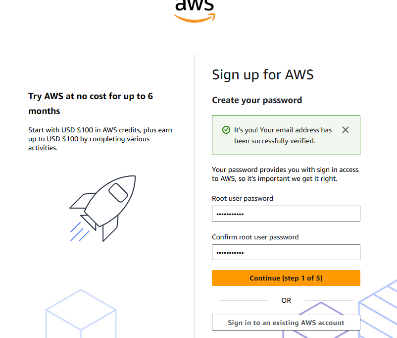
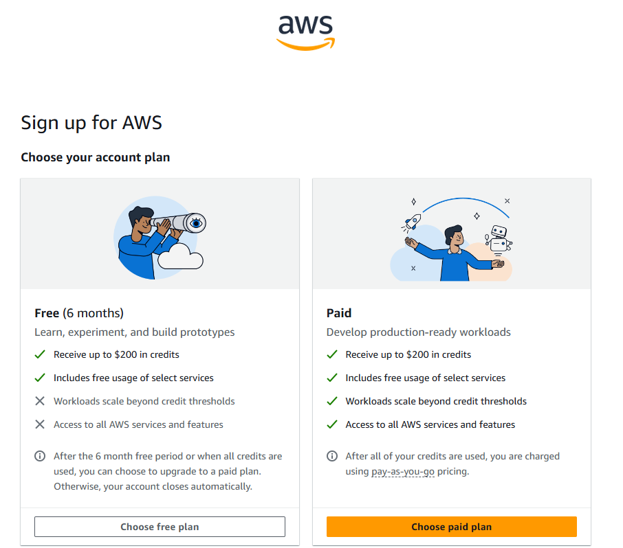
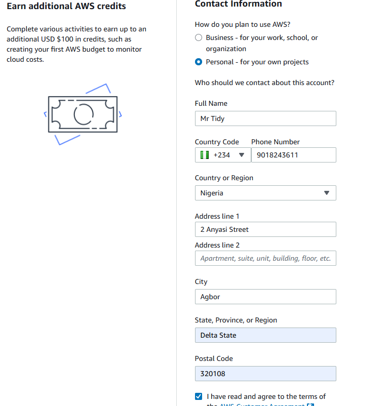
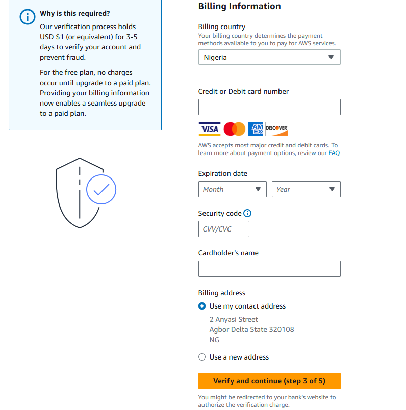
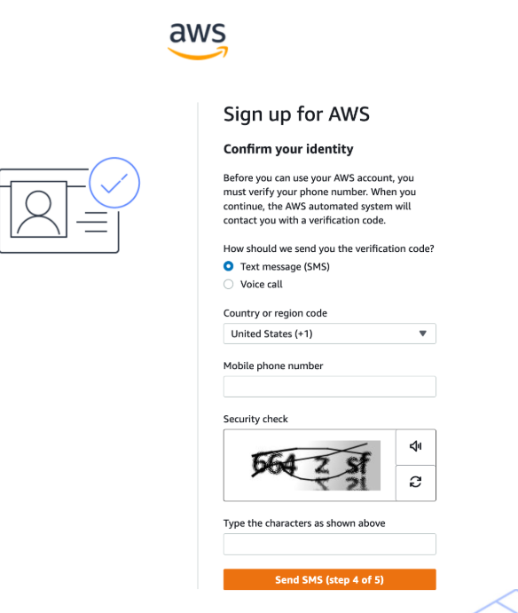
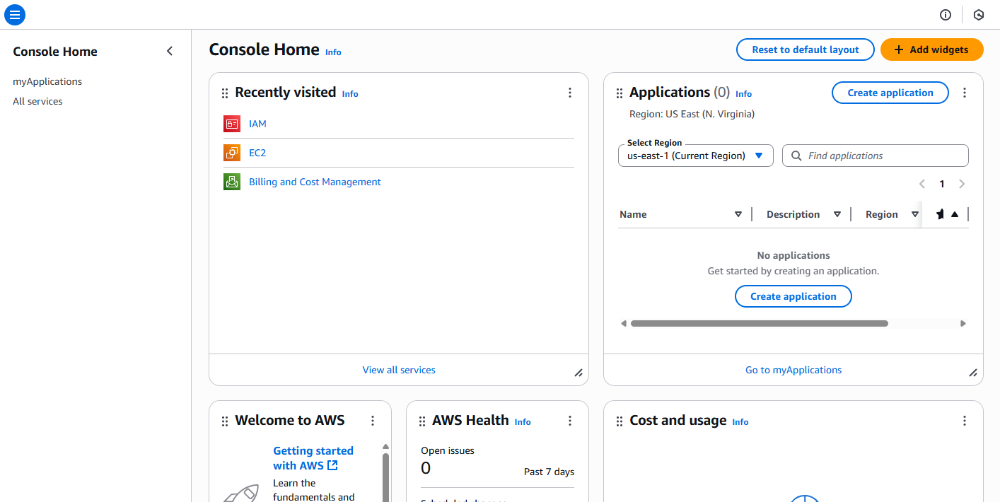

# AWS Account Creation Guide

This guide provides a clear, step-by-step walkthrough for creating an
Amazon Web Services (AWS) account. It highlights the key actions and
decisions involved in setting up your AWS account, from entering your
email to signing in to the AWS console.

## Setting Up Your AWS Account

1.  **Visit the AWS Website**\
    Navigate to <https://aws.amazon.com/> and click **Create account**.

    

2.  **Enter Email and Account Name**\
    Provide your email address (used as the root user login) and an AWS
    account name, then click **Verify email address**.

    

3.  **Verify Your Email**\
    Enter the verification code sent to your email and click **Verify**.

    

4.  **Create a Root User Password**\
    Set a strong password and confirm it, then click **Continue**.

    

5.  **Choose a Plan**\
    For this guide, select **Free plan**.

    

6.  **Provide Contact Information**\
    Choose **Personal use**, complete the form, accept the terms, and
    click **Agree and Continue**.

    

7.  **Enter Billing Information**\
    Add valid billing details and click **Verify and Continue**.

    

8.  **Confirm Your Identity**\
    Verify your identity using a text message or voice call to receive
    and enter the code.

    

9.  **Select a Support Plan**\
    AWS offers multiple support levels. For this guide, select **Basic
    support -- Free**.

10. **Complete Sign Up**\
    Click **Complete sign up**. AWS will activate your account and send
    a confirmation email.

11. **Sign In to the Console**\
    After activation, click **Sign in to console**, enter your root user
    email, complete the captcha, and provide your password.

    

## Conclusion

Creating an AWS account is a straightforward process when approached
step by step. By following this guide, you have successfully set up a
fully functional AWS account ready for cloud deployments and service
exploration. With your account activated, you can now explore AWS
services, manage resources, and begin building projects with confidence.
Remember to secure your root credentials and consider creating IAM users
for everyday operations to maintain best security practices.
